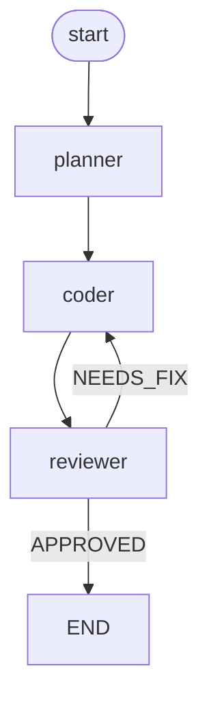
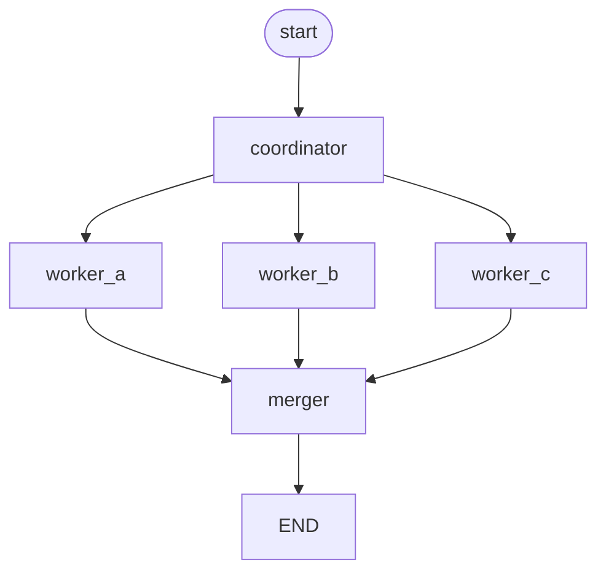
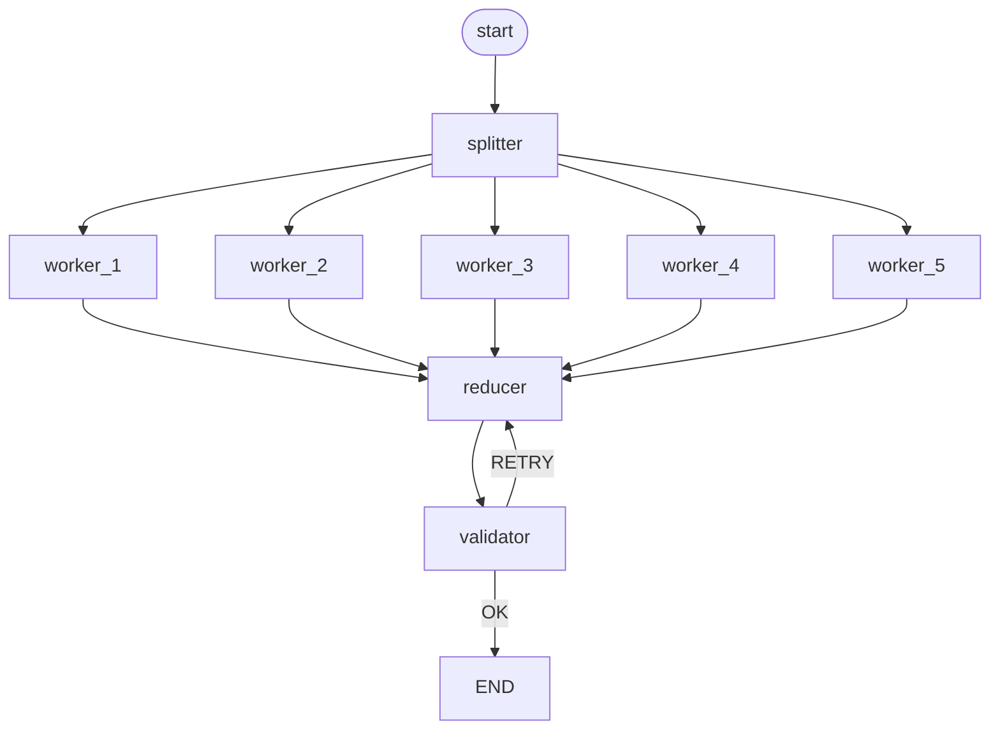

# pixelgo — Documentation

Runtime for AI agents: isolated agents (sandbox + resource limits), driven by
LLM models (Anthropic / OpenAI / Gemini), orchestrated among themselves through a
graph declared in a DSL.

---

## Table of contents

1. [Concepts](#concepts)
2. [Install and build](#install-and-build)
3. [Multi-provider: Claude, ChatGPT, Gemini](#multi-provider)
4. [The `.flow` DSL](#the-flow-dsl)
5. [How the agents communicate](#how-the-agents-communicate)
6. [Examples](#examples)
7. [CLI reference](#cli-reference)
8. [Advanced configuration](#advanced-configuration)
9. [Data request approval gateway](#data-request-approval-gateway)
10. [Interactive chat](#interactive-chat-conversation-with-memory)
11. [Visualizing the run](#visualizing-the-run-the-circulating-pixels)
12. [Costs and tokens](#costs-and-tokens)
13. [API keys (.env file)](#api-keys-env-file)
14. [Web interface](#web-interface)
15. [Multiple workspaces](#multiple-workspaces)
16. [Simple chat agent](#simple-chat-agent-no-tools)
17. [Internal architecture](#internal-architecture)

---

## Concepts

**Workspace** — a container for a set of agents. It has its own directory and a
`workspace.conf` file with the configuration of all the agents.

**Agent** — an isolated execution unit. Two types:
- `worker` — runs a fixed command (isolated process, no AI).
- `ai` — driven by an LLM model: receives a task, can call tools
  (`read_file`, `write_file`, `list_dir`), and iterates until done.

Each agent runs in its own process (`fork`), with `chdir` into its own directory
(sandbox), with optional resource limits (CPU, memory, timeout).

**One agent = one model.** Each AI agent has EXACTLY one provider and one model.
It does not switch models during a conversation — that would break the message
history (the formats differ between providers).

**Flow (graph)** — a `.flow` file that describes how the agents communicate:
which node follows which, under what conditions, what runs in parallel.

**Orchestrator** — runs the graph: starts the nodes, passes them the messages,
evaluates the conditions, runs in parallel what it can.

---

## Install and build

Dependencies: `gcc`, `make`, `libcurl` (dev headers).

```bash
sudo apt-get install build-essential libcurl4-openssl-dev
make
```

This produces the `./pixelgo` binary.

API keys go in a `.env` file (see [API keys](#api-keys-env-file)):

```bash
cp .env.example .env
nano .env          # put your keys
chmod 600 .env
pixelgo keys         # check what was loaded
```

Or, if you prefer, directly in the environment (`export ANTHROPIC_API_KEY=...`).

Logging level (default `info`):

```bash
export PIXELGO_LOG_LEVEL=debug   # debug | info | warn | error
```

---

## Multi-provider

Three providers are supported. Each agent picks one.

| Provider | Config value | API key (env) | Example models |
|---|---|---|---|
| Anthropic (Claude) | `anthropic` | `ANTHROPIC_API_KEY` | `claude-sonnet-5`, `claude-opus-4-8` |
| OpenAI (ChatGPT) | `openai` | `OPENAI_API_KEY` | `gpt-4o`, `gpt-4o-mini` |
| Google (Gemini) | `gemini` | `GEMINI_API_KEY` | `gemini-2.0-flash`, `gemini-1.5-pro` |

### How to add an agent on each provider

```bash
# Claude
pixelgo agent add ai myws architect anthropic claude-sonnet-5 \
  "You are a software architect. You design clean solutions." \
  "read_file,list_dir"

# ChatGPT
pixelgo agent add ai myws coder openai gpt-4o \
  "You are a programmer. You write correct, tested code." \
  "read_file,write_file,list_dir"

# Gemini
pixelgo agent add ai myws researcher gemini gemini-2.0-flash \
  "You are a researcher. You summarize quickly and concisely." \
  "read_file,list_dir"
```

Syntax: `pixelgo agent add ai <workspace> <id> <provider> <model> <system_prompt> <tools_csv>`

### Why it matters (and what the runtime does for you)

The three APIs are completely different. The runtime hides them behind an adapter
layer — you write a single system prompt and a single list of tools, and the
adapter translates:

| | Anthropic | OpenAI | Gemini |
|---|---|---|---|
| Endpoint | `/v1/messages` | `/v1/chat/completions` | `:generateContent` |
| Authentication | `x-api-key` header | `Bearer` header | `?key=` in URL |
| System prompt | camp `system` | mesaj `role:"system"` | camp `systemInstruction` |
| Mesaje | `messages[]` | `messages[]` | `contents[]` |
| Assistant role | `assistant` | `assistant` | `model` |
| Tool call | `content[].tool_use` | `tool_calls[]` | `parts[].functionCall` |
| Tool arguments | JSON object | JSON **string** | JSON object |
| Tool result | `tool_result` + `tool_use_id` | `role:"tool"` + `tool_call_id` | `functionResponse` (linked by **name**) |

The AI loop (`ai_loop.c`) knows none of this. It speaks a neutral internal
format; the adapters translate both ways.

**Mix providers freely in the same graph** — see
[`examples/03-multi-provider.flow`](examples/03-multi-provider.flow).

---

## The `.flow` DSL

A simple text file. Three directives: `entry`, `node`, `edge`.

```
# comments start with #

entry planner              # the node execution starts from

node planner               # a node = an existing agent in the workspace
node coder
node reviewer

edge planner -> coder                   # unconditional transition
edge coder   -> reviewer

edge reviewer -> coder when NEEDS_FIX   # CONDITIONAL transition
edge reviewer -> END   when APPROVED    # END = termination
```

### Rules

**`entry <id>`** — the start node. Required.

**`node <id>`** — declares a node. The id must match an agent in the workspace
(validated before running; if the agent is missing, the graph is rejected).

**`edge A -> B`** — unconditional transition: after A finishes, B runs.

**`edge A -> B when MARKER`** — conditional transition: B runs only if A's output
**contains** the substring `MARKER`.

**`END`** — a special node. When it is reached, the graph ends.

### How conditions work

An agent signals its decision by writing a marker in its final response. For
example, you give the reviewer a system prompt like:

> "Check the code. If you find problems, respond with details and end with the
> word NEEDS_FIX. If it is fine, end with the word APPROVED."

The orchestrator looks for the marker in the output and picks the matching edge.

**Evaluation order:** conditional edges first (the first match wins), then the
unconditional ones as a fallback.

### FAN-OUT: parallelism

Several edges **leaving** the same node = the targets run **in parallel**:

```
edge coordinator -> worker_a
edge coordinator -> worker_b
edge coordinator -> worker_c
```

The 3 workers start simultaneously (one process each). If each takes 2 seconds,
the total is ~2 seconds, not 6.

### FAN-IN: synchronization

Several edges **arriving** at the same node = the node waits for **all** of them:

```
edge worker_a -> merger
edge worker_b -> merger
edge worker_c -> merger
```

`merger` runs only after all 3 workers have finished, and receives everyone's
outputs.

### Loops

They are allowed. A conditional edge can send execution back:

```
edge reviewer -> coder when NEEDS_FIX
```

Protection: `ORCH_MAX_STEPS` (50) stops the graph if a loop does not close.

---

## How the agents communicate

Communication is **synchronous, per edge** (handoff), through files in the sandbox:

1. An agent writes its final response to `<agent_dir>/_output.txt`.
2. The orchestrator reads the output, decides the next node, and writes the
   message to `<next_dir>/_input.txt`.
3. On startup, the next agent combines its base task with `_input.txt`.

**On fan-in**, the node receives the outputs of ALL predecessors, labeled:

```
--- Result from 'worker_a' ---
sub-result from worker_a

--- Result from 'worker_b' ---
sub-result from worker_b

--- Result from 'worker_c' ---
sub-result from worker_c
```

This way `merger` knows exactly who produced what.

Everything stays in the sandbox and is inspectable on disk — good for debugging.

---

## Examples

All examples are in `examples/` and can be run directly.

### 1. Pipeline with a correction loop

[`examples/01-pipeline-review.flow`](examples/01-pipeline-review.flow)

```
entry planner
node planner
node coder
node reviewer
edge planner  -> coder
edge coder    -> reviewer
edge reviewer -> coder  when NEEDS_FIX
edge reviewer -> END    when APPROVED
```



Full setup:

```bash
pixelgo workspace create dev

pixelgo agent add ai dev planner anthropic claude-sonnet-5 \
  "You are a planner. You break the task into clear steps." "list_dir"

pixelgo agent add ai dev coder openai gpt-4o \
  "You are a programmer. You implement the plan you receive." "read_file,write_file,list_dir"

pixelgo agent add ai dev reviewer anthropic claude-sonnet-5 \
  "You check the code. If you have objections, end with NEEDS_FIX. If it is good, end with APPROVED." \
  "read_file,list_dir"

pixelgo flow run dev examples/01-pipeline-review.flow "Write a CSV parser in C"
```

### 2. Coordinator + parallel workers (fan-out / fan-in)

[`examples/02-fanout-workers.flow`](examples/02-fanout-workers.flow)

```
entry coordinator
node coordinator
node worker_a
node worker_b
node worker_c
node merger
edge coordinator -> worker_a
edge coordinator -> worker_b
edge coordinator -> worker_c
edge worker_a -> merger
edge worker_b -> merger
edge worker_c -> merger
edge merger -> END
```



Setup — three specialized workers, each on a different piece:

```bash
pixelgo workspace create analysis

pixelgo agent add ai analiza coordinator anthropic claude-sonnet-5 \
  "You split the analysis into 3 areas: security, performance, style. You describe what must be done in each." \
  "list_dir,read_file"

pixelgo agent add ai analysis worker_a gemini gemini-2.0-flash \
  "You analyze ONLY the code security. You report vulnerabilities." "read_file,list_dir"

pixelgo agent add ai analysis worker_b gemini gemini-2.0-flash \
  "You analyze ONLY performance. You report bottlenecks." "read_file,list_dir"

pixelgo agent add ai analysis worker_c gemini gemini-2.0-flash \
  "You analyze ONLY style and readability." "read_file,list_dir"

pixelgo agent add ai analysis merger anthropic claude-sonnet-5 \
  "You receive 3 reports (security, performance, style). You combine them into a single, prioritized report." \
  "write_file"

pixelgo flow run analysis examples/02-fanout-workers.flow "Analyze the project in src/"
```

The 3 workers run **simultaneously** — the analysis takes as long as the slowest
of them, not the sum of them.

### 3. Different providers in the same graph

[`examples/03-multi-provider.flow`](examples/03-multi-provider.flow)

```
entry researcher
node researcher    # gemini  - fast, cheap
node architect     # claude  - complex reasoning
node coder         # gpt-4o  - code generation
node reviewer      # claude  - careful checking
edge researcher -> architect
edge architect  -> coder
edge coder      -> reviewer
edge reviewer -> coder when NEEDS_FIX
edge reviewer -> END   when APPROVED
```

```bash
pixelgo workspace create mixed

pixelgo agent add ai mixed researcher gemini    gemini-2.0-flash "You are a researcher. You summarize quickly." "read_file,list_dir"
pixelgo agent add ai mixed architect  anthropic claude-sonnet-5  "You are an architect."                     "read_file"
pixelgo agent add ai mixed coder      openai    gpt-4o           "You are a programmer."                     "read_file,write_file"
pixelgo agent add ai mixed reviewer   anthropic claude-sonnet-5  "You check. NEEDS_FIX or APPROVED."         "read_file"

pixelgo flow run mixed examples/03-multi-provider.flow "Add support for YAML files"
```

The idea: put the right model on the right job. Gemini for high volume and cheap,
Claude for reasoning, GPT-4o for code.

### 4. Map-Reduce with 5 workers

[`examples/04-map-reduce.flow`](examples/04-map-reduce.flow)



Shows that fan-out scales — add as many workers as you want, all run at once.
The validator can request re-aggregation (`RETRY`) if the result is not good.

### Non-AI workers (shell commands)

Not all agents need to be AI. A `worker` runs a fixed command — useful for
builds, tests, formatting:

```bash
pixelgo agent add worker ci builder  /usr/bin/make
pixelgo agent add worker ci tester   /bin/sh -c "make test > _output.txt 2>&1"
pixelgo agent add worker ci linter   /bin/sh -c "gcc -fsyntax-only src/*.c 2>&1 > _output.txt"
```

They mix freely with AI agents in the same graph: a worker runs the tests, and an
AI agent reads the result and fixes it.

---

## CLI reference

```bash
# Workspace
pixelgo workspace create <name>
pixelgo workspace list                       # lists all workspaces

# Agents
pixelgo agent add worker <ws> <id> <command> [arg1 arg2 ...]
pixelgo agent add ai     <ws> <id> <provider> <model> <system_prompt> <tool1,tool2,...> [cmd1,cmd2,...]
#   last argument = the commands allowed for run_command (e.g. "gcc,make")
pixelgo agent list       <ws>
pixelgo agent run        <ws> <id> [task]     # a single question (no memory)
pixelgo agent chat       <ws> <id> [--reset] # interactive conversation (with memory)

# Graphs
pixelgo flow run     <ws> <file.flow> [initial_task]
pixelgo flow diagram <file.flow>          # generates a Mermaid diagram

# Web interface
pixelgo serve [port]                        # default 8080
```

`flow diagram` emits a Mermaid `flowchart` you can paste anywhere (GitHub,
Notion, mermaid.live) to see the graph drawn.

### Tools available to AI agents

| Tool | What it does | Arguments |
|---|---|---|
| `read_file` | reads a file from the sandbox | `path` |
| `write_file` | writes a file to the sandbox | `path`, `content` |
| `list_dir` | lists a directory | `path` (optional) |
| `search_files` | searches text recursively (like grep) | `pattern`, `path` (optional) |
| `run_command` | **runs a command** and returns output + exit code | `command`, `args`, `timeout_seconds` |

Tools are given to the agent at creation (CSV list). An agent can use **only** the
tools explicitly given to it — the dispatcher refuses the rest.

All file operations go through the sandbox: an agent cannot leave its directory
(not via `..`, not via an absolute path, not via a symlink).

---

## `run_command` — how the agent becomes a real programmer

Without `run_command`, an agent writes code **blind**: it cannot compile, cannot
run tests, never finds out whether what it wrote works. With it, the agent can do
the loop every programmer does:

**write the code → compile → read the error → fix → recompile → verify**

The tool returns combined `stdout` + `stderr` AND the **exit code**. The exit
code is essential: without it, the model would not know whether it worked.

Example of the result the model sees after a failed compilation:

```
Error: Exit code: 1 (command failed)

--- Output ---
main.c: In function 'main':
main.c:2:35: error: expected ';' before 'return'
    2 | int main(){ printf("hello\n") return 0; }
      |                                   ^~~~~~
```

The model sees the exact error, with line and column — so it can fix it.

### Security: how it is built to do no harm

`run_command` is the most dangerous tool possible, so it has defense in depth:

**1. Mandatory allowlist (fail-closed).** An agent can run **only** the commands
explicitly written in its config. An empty allowlist = no command allowed (not
"all allowed"). It is given as the last argument to `agent add ai`:

```bash
pixelgo agent add ai dev coder anthropic claude-sonnet-5 \
  "You are a programmer. You write code, compile it, and fix the errors." \
  "read_file,write_file,list_dir,run_command,search_files" \
  "gcc,make"
```

Here the agent can run **only** `gcc` and `make`. Anything else is refused:

```
Error: command 'rm' not permitted. Allowed commands: gcc, make
```

**2. No shell — injection is impossible by construction.** We use `fork` +
`execvp`, NOT `system()`. There is no shell to interpret `;`, `|`, `&&`, `>`,
`$(...)`. They are just text.

If the model (or someone tricking it) asks for:
```json
{"command":"echo","args":["hello; rm -rf /"]}
```
the result is that the text `hello; rm -rf /` is **printed**. Nothing is deleted.
This is not metacharacter filtering (which is always incomplete) — it is a
structural property: with no shell, there is nothing to inject.

Practical consequence: **shell operators do not work**. You cannot do
`{"command":"make && ./test"}`. You make two separate calls. The tool description
tells the model this explicitly.

**3. Timeout.** Default 60s, configurable per call. On expiry: SIGTERM on the
whole process group, then SIGKILL. No processes are left hanging.

**4. Sandbox.** The command runs with `chdir` into the agent's directory.

**5. Truncated output** at 8 KB, so the model's context does not blow up.

### Full example: an agent that verifies its own code

```bash
pixelgo workspace create dev

pixelgo agent add ai dev coder anthropic claude-sonnet-5 \
  "You are a C programmer. You write code, compile it with gcc, and if there are errors you fix them. You do not stop until it compiles cleanly." \
  "read_file,write_file,list_dir,run_command,search_files" \
  "gcc,make"

pixelgo agent run dev coder "Write a program that computes factorial and make sure it compiles"
```

The agent will: write a `.c`, run `gcc`, see the errors (if any), fix, recompile,
and stop only when exit code = 0.

---

## Advanced configuration

The configuration lives in `workspaces/<name>/workspace.conf`. It can be edited
manually.

```ini
[workspace]
name=dev

[agent]
id=coder
type=ai
dir=workspaces/dev/agents/coder
provider=openai
model=gpt-4o
system_prompt=You are a programmer.
tools=read_file,write_file,list_dir
allowlist=
limit_timeout_seconds=300
limit_mem_bytes=536870912
limit_cpu_seconds=120
limit_fsize_bytes=10485760
```

### Resource limits

Applied in the child process (via `setrlimit`), before the agent starts.
Zero / missing = no limit.

| Field | Effect |
|---|---|
| `limit_cpu_seconds` | max CPU time (RLIMIT_CPU) |
| `limit_mem_bytes` | max virtual memory (RLIMIT_AS) |
| `limit_fsize_bytes` | max size of a written file (RLIMIT_FSIZE) |
| `limit_timeout_seconds` | wall-clock: the parent stops the agent after this long (SIGTERM, then SIGKILL) |

An agent stopped by timeout is **not** restarted (it is probably structurally
stuck). An agent that fails otherwise can be restarted (AI agents: once).

---

## Data request approval gateway

`--approve` (see the README) gates *what an agent does* — a tool call.
`--data-threshold` gates *what it sends to the provider* — the size of the
next request, checked before it goes out.

### Why this exists

An agent's context grows every iteration: the system prompt, the full
conversation so far, every tool result. A single `read_file` on a large log
or a verbose `run_command` output can push the next request's size — and
its cost — up sharply, with nothing stopping it before the bill arrives.
`--data-threshold` is that stop.

### Configuring it

```bash
./pixelgo agent add ai demo coder anthropic claude-sonnet-5 \
  "You are a programmer." \
  "read_file,write_file" "" \
  --data-threshold 500KB
```

Accepts a raw byte count, a size with a `KB`/`MB`/`GB` suffix
(case-insensitive), or the literal `off`.

**Three states, not two.** This matters once you have several agents:

| What you pass | Meaning |
|---|---|
| no `--data-threshold` flag at all | inherits `PIXELGO_DATA_THRESHOLD` (see below) if set, otherwise disabled |
| `--data-threshold 500KB` (or any size) | this agent's own threshold — overrides the global default, even if one is set |
| `--data-threshold off` | explicitly disabled for this agent — overrides the global default too, so a global default set elsewhere never silently re-enables it |

```bash
export PIXELGO_DATA_THRESHOLD=500KB

./pixelgo agent add ai demo reviewer anthropic claude-sonnet-5 "..." ""
#   -> no flag: inherits the 500KB global default

./pixelgo agent add ai demo coder anthropic claude-sonnet-5 "..." "" \
  --data-threshold 2MB
#   -> explicit: 2MB, ignores the 500KB global default

./pixelgo agent add ai demo scratch anthropic claude-sonnet-5 "..." "" \
  --data-threshold off
#   -> explicitly off, ignores the 500KB global default
```

`PIXELGO_DATA_THRESHOLD` is read fresh from the environment at the point of
each check (same convention as `PIXELGO_COMMAND_TIMEOUT`,
`PIXELGO_MAX_ITERATIONS`, `PIXELGO_HTTP_MAX_BODY`) — not cached when the
agent was created, so changing it takes effect on the next run without
recreating any agent. It accepts the same spellings as `--data-threshold`
(a size, or `off`); an unparseable value logs a warning and is treated as
disabled.

The per-agent choice persists in `workspace.conf` as three distinct forms,
matching the three states above:

```ini
[agent]
id=reviewer
...
# no data_approve_threshold line at all -> inherits the global default

[agent]
id=coder
...
data_approve_threshold=2097152        # explicit value, always stored as
                                       # raw bytes regardless of what
                                       # suffix was used on the command line

[agent]
id=scratch
...
data_approve_threshold=off            # explicitly disabled
```

The `off` form matters specifically because it's the only way to tell "not
specified" and "specified as disabled" apart on reload — leaving the line
out entirely, the way earlier versions of this feature handled disabling,
would have made an explicit opt-out silently start inheriting the global
default again after a restart.

### What happens over threshold

Before each call to the provider, `ai_loop` resolves the effective
threshold (the agent's own, or the global default if it didn't set one),
sums the current payload size (system prompt + the full `messages` history
as it would actually be sent)
and compares it to the threshold. If it's over:

1. It builds a preview of the **actual request**: `model`, `system` (if
   set), the full `messages` array exactly as it stands, and `tools` (if
   any) — pretty-printed as real JSON. This is pixelgo's internal
   ("neutral") request shape, not a summary or a single block picked out
   of context. For Anthropic agents this preview IS the exact body that
   gets sent (the neutral format is deliberately close to Anthropic's
   Messages API - see `src/runtime/providers/anthropic.c`); for
   OpenAI/Gemini agents the same content is translated into that
   provider's own wire format (different field names, different tool-call
   encoding) immediately after this step, so what's reviewed here is the
   conversation before translation, not the literal bytes that provider's
   API receives.
2. If a web job is running, it opens the browser dialog described in the
   README, with three outcomes: send the edited JSON (its `messages` array
   wholesale replaces the live conversation - deleting a whole turn from
   the JSON simply removes it, not just its text), approve the request
   unchanged without re-uploading it, or cancel (denies, stops the agent).
   If the edited text fails to parse as JSON, or has no `messages` array,
   the request is **denied outright** - never sent malformed, and the
   edit is never silently discarded in favor of the stale original either.
3. Otherwise (CLI run, or no web job attached), it falls back to the same
   plain approve/deny prompt used for tool calls — the check still runs,
   it just can't offer editing.
4. Every decision is appended to `~/.local/share/pixelgo/data_audit.log`:

   ```
   1755612345 | ws=demo | agent=coder | payload=612000 bytes | tokens=~153000 | cost=$0.459000 | decision=approved
   ```

   The cost estimate uses the same pricing table `pixelgo costs` reports
   from; the token estimate is a ~4-bytes-per-token rule of thumb, not the
   provider's real tokenizer — good enough for a warning, not for billing
   reconciliation.

### The edit dialog's size limit

The dialog's textarea can display a block of any size (the browser fetches
it with no cap), but sending an *edited* version back is bounded by how
large a request body the web server accepts — 64KB by default. A block
larger than that can still be reviewed and approved (via "Approve as-is",
which sends no text at all — the agent keeps using what it already had),
but not edited down through the browser unless the cap is raised:

```bash
PIXELGO_HTTP_MAX_BODY=2MB ./pixelgo serve 8080
```

Accepts the same formats as `PIXELGO_DATA_THRESHOLD`/`--data-threshold` -
a `KB`/`MB`/`GB` size or a raw byte count, via the same parser (there is no
reason this one variable alone should demand raw bytes while the other two
accept friendly sizes). Read from the environment on every request (not
cached at startup), and clamped to `[64KB, 4MB]` — the upper bound is sized
around the largest context window current model providers accept (~1M
tokens; a request bigger than that couldn't reach the model regardless of
what this server allows through). The server reports its actual configured
value at `GET /api/limits`, which the dialog's byte counter and Send button
read from directly, so they never work off a stale assumption.

---

## Interactive chat (conversation with memory)

Two ways to talk to an AI agent:

| Command | What it does | Remembers? |
|---|---|---|
| `pixelgo agent run <ws> <id> "question"` | a single question, then exits | **No** — isolated process, starts clean |
| `pixelgo agent chat <ws> <id>` | interactive loop in the terminal | **Yes** — the history persists |

### What it looks like

```
$ pixelgo agent chat dev assistant
Chat with 'assistant' (anthropic / claude-sonnet-5)
Tools: read_file, search_files, run_command
Type your message. 'exit' or Ctrl+D to quit.

> My name is Bob
Hi, Bob!

> What is my name?
Your name is Bob.       <-- it remembers

> /reset
(history cleared - new conversation)

> What is my name?
I don't know, you didn't tell me.  <-- it forgot, as requested

> exit
```

Commands during chat: `exit` / `quit` / Ctrl+D to quit, `/reset` to clear the
history and start a new conversation.
You can start directly with the history cleared: `pixelgo agent chat dev assistant --reset`.

### How memory works

The full conversation history is saved to `<agent_dir>/_history.json` after each
turn and reloaded on the next. It is in the agent's sandbox, so you can inspect it
on disk.

**Automatic truncation.** A long conversation exceeds the model's context limit.
When the history grows past `HISTORY_MAX_MESSAGES` (40), we trim the old messages.

The trimming is NOT naive: the protocol requires an assistant message with
`tool_use` to be followed by the user message with its `tool_result`s. If we cut
between them, an orphan `tool_result` would remain and the API would reject the
request. So we cut only at a **safe** boundary — the first user message that does
not start with `tool_result`.

### Pure chat vs chat with tools

The same mechanism, configured differently **at the agent level** (not the
command). The run mode says *how* you talk to the agent; the agent's config says
*what it can do*.

**Pure conversational assistant** (no tools):
```bash
pixelgo agent add ai chat writer anthropic claude-sonnet-5 \
  "You are an editor. You help write and proofread texts." \
  ""
pixelgo agent chat chat writer
```

**Programming assistant** (conversation + can read the code and run tests):
```bash
pixelgo agent add ai chat dev anthropic claude-sonnet-5 \
  "You are a programming assistant. You can read the code, search in it, and run tests. Always verify what you write." \
  "read_file,write_file,list_dir,search_files,run_command" \
  "gcc,make"
pixelgo agent chat chat dev
```

The second is an assistant you can actually work with: you ask it to find a bug,
it searches the code, reads the file, proposes a fix, compiles it, and sees
whether it works — all in one conversation, with context kept between messages.

---

## Visualizing the run (the circulating pixels)

When you run a graph in the web interface, you see it **animated in real time**:

- **The active node pulses** — you see who is working now
- **Pixels travel along edges** — you see messages passing from one agent to another
- **Color per provider** — Claude purple, GPT green, Gemini blue. You see at a
  glance which model works where.
- **Cost and duration per node**, as each finishes
- **Fan-out**: several pixels leave at once → you see the parallelism
- **Fan-in**: the pixels converge → you see the synchronization

The pixel size grows with the message volume. So you see **where the volume
flows** — and why you put the cheap model there.

### Cum functioneaza

The orchestrator writes an **event journal** (`jobs/<id>.events`, JSONL format)
as it runs:

```json
{"t":"node_start","ms":0,"node":"coordinator","provider":"gemini","model":"gemini-2.0-flash"}
{"t":"node_done","ms":1004,"node":"coordinator","cost_micro_usd":18000,"duration_ms":1003}
{"t":"edge_flow","ms":1004,"from":"coordinator","to":"w1","bytes":16,"condition":""}
```

The frontend polls `GET /api/jobs/<id>/events?from=N` and receives only the
**new** events (from index N), then applies them to the graph.

**Why JSONL and not one big JSON:** writing is APPEND (we do not re-read/rewrite
the whole file on each event), and the reader can consume the lines as they
appear.

**Why a file and not memory:** the orchestrator runs in a CHILD process (job),
separate from the server. After `fork`, memory is not shared.

### The graph layout

Nodes are placed on **levels** (BFS from `entry`). Nodes on the same level run in
parallel → they appear one under another, in the same column.

**Watch out for loops:** a graph with `reviewer -> coder when NEEDS_FIX` has a
cycle. A naive level relaxation would grow forever and **freeze the browser**.
Each node gets its level once (first visit), and the loop edge is drawn backward.
(Bug caught in testing — see `t_layout.js`.)

---

## Costs and tokens

The project's central argument: **you put the cheap model to do the volume and the
expensive model only where reasoning is really needed**. But without numbers, it
is just a claim. So the runtime measures everything.

After each graph run, you see:

```
--- cost per agent ---
  researcher       gemini     gemini-2.0-flash   in=200000  out=5000   $0.02
  architect        anthropic  claude-sonnet-4-5  in=10000   out=3000   $0.07
--- total: in=210000 out=8000 cost=$0.10 ---
--- if the whole graph had run on claude-sonnet-4-5: $0.75 ---
--- SAVINGS: $0.65 (88%) ---
```

The same information appears in the web interface, after a graph run.

### Cum functioneaza

Each provider reports usage differently:

| Provider | Field in the response |
|---|---|
| Anthropic | `usage.input_tokens` / `usage.output_tokens` |
| OpenAI | `usage.prompt_tokens` / `usage.completion_tokens` |
| Gemini | `usageMetadata.promptTokenCount` / `candidatesTokenCount` |

The adapters normalize them. An agent can make several calls in one run
(tool_use -> result -> tool_use -> ...), so usage is **summed** over the whole
loop and written to `<agent_dir>/_usage.json`. The orchestrator totals them.

### Pricing (`pricing.conf`)

**Model prices change often.** The values in the code are a starting point, but
you can override them without recompiling:

```bash
cp pricing.conf.example pricing.conf
nano pricing.conf
```

```ini
# provider  model_prefix  input_per_1M_usd  output_per_1M_usd
anthropic   claude-sonnet     3.00   15.00
gemini      gemini-2.0-flash  0.10    0.40
openai      gpt-4o-mini       0.15    0.60
```

Matching is done on **prefix**, so `claude-sonnet` also catches
`claude-sonnet-4-5-20250929`. The **longest** prefix wins (`gpt-4o-mini` is not
confused with `gpt-4o`).

If a model is not in the table, the displayed cost is **0** and you get a warning
— we prefer to show nothing rather than a false number.

### Why it matters

A real example from a code-review graph:

- `researcher` on **Gemini Flash** reads 50 files and summarizes → 200k tokens, **$0.02**
- `architect` on **Claude** makes the decision on the summary → 10k tokens, **$0.07**

Total: **$0.10**. If you had sent everything to Claude: **$0.75**.

This is what you **cannot do** with an agent tied to a single provider.

---

## API keys (.env file)

You don't have to `export` every time. Put the keys in a file:

```bash
cp .env.example .env
nano .env              # put your keys
chmod 600 .env         # only you can read the file
```

The contents:

```ini
# comments start with #
ANTHROPIC_API_KEY=sk-ant-...
OPENAI_API_KEY="sk-..."          # the quotes are optional
export GEMINI_API_KEY='AIza...'  # "export" is accepted too

PIXELGO_LOG_LEVEL=info

# Raises the cap on request bodies the web UI can send (default 64KB,
# ceiling 4MB - see the "data-threshold" agent option). Only needed if
# you configure a large --data-threshold and want to trim/approve big
# blocks through the browser instead of via "Approve as-is". Accepts a
# size like "2MB" or a raw byte count.
# PIXELGO_HTTP_MAX_BODY=2MB
```

Check what was loaded:

```bash
pixelgo keys
```

```
Config file: .env

  anthropic  OK      sk-ant...cdef  (108 chars)
  openai     MISSING (set OPENAI_API_KEY)
  gemini     OK      AIzaSy...2345  (39 chars)
```

The keys are **masked** — you see they are set and check they are the right ones,
without exposing them.

### Where it looks for the file

In order, the first found wins:

1. the path from `PIXELGO_ENV_FILE`, if set
2. `./.env` (the current directory)
3. `~/.config/pixelgo/env`

If none exists, it is not an error — the keys can come directly from the environment.

### Priority

**An `export` beats the file.** Variables already present in the environment are
not overwritten. This way you can temporarily override a key without editing
anything:

```bash
ANTHROPIC_API_KEY=another-key pixelgo serve
```

### Where to get the keys

| Provider | Where | Notes |
|---|---|---|
| Anthropic | console.anthropic.com → API Keys | requires credit |
| OpenAI | platform.openai.com → API keys | requires credit; **a ChatGPT Plus subscription does NOT include API** |
| Google | aistudio.google.com/apikey | has a **free tier** — easiest for the first test |

For a first test without paying: get a **Gemini** key (free), and use
`provider=gemini`, `model=gemini-2.0-flash`.

### Security

- `.env` is in `.gitignore` — it does not reach git.
- `chmod 600 .env` — only you read it. If it is readable by others, `pixelgo`
  warns you at startup.
- The keys are loaded into the environment **before any fork**, so they reach the
  daemon, the HTTP handlers and the agent processes correctly.

---

## Web interface

```bash
pixelgo serve                  # foreground, http://127.0.0.1:8080
pixelgo serve 3000             # another port
pixelgo serve --daemon         # in the background (daemon)
pixelgo serve status           # running? on what pid/port?
pixelgo serve stop             # stop the daemon
```

Three tabs: **Chat** (conversation with history, you also see the tools used),
**Agents** (create workspaces/agents), **Graphs** (Mermaid diagram + run).

### Architecture: 4 separate layers

```
  http_server.c   HTTP transport (socket, parsing, response)
                  knows NOTHING about agents - reusable
        |
  web_api.c       routing: maps URLs to the core functions
        |
  jobs.c          ASYNCHRONOUS and ISOLATED running of agents (fork)
        |
  core            workspace / ai_loop / orchestrator / tools
                  the same functions the CLI calls
```

Zero duplicated logic: the web is just another front-end over the same core.

### Jobs: why agents do NOT run in the server

The first version ran the agent directly in the HTTP handler. Two serious
problems: an agent that crashed took the server with it, and the HTTP request
stayed blocked for tens of seconds while the model worked.

Now each agent run is a **job**:

1. The server does `fork()`. The child runs the agent **isolated** (sandbox +
   rlimit, exactly as in the CLI).
2. The parent returns a `job_id` **immediately** (HTTP responds in ~10ms).
3. The client polls `GET /api/jobs/<id>` until it is `done` or `failed`.

Job state is kept on disk (`jobs/<id>.json`), not in memory — the child is a
different process, memory is not shared after `fork`.

**Crash detection:** if the file says `running` but the process no longer exists
(segfault, OOM-kill), `job_get` marks the job `failed`. Otherwise it would stay
"running" forever.

Measured: an agent working for 3 seconds -> HTTP responds in **12ms**.
An agent that kills itself with `kill -9` -> job `failed`, **the server stays
alive**.

### Concurrency

The server does `fork` per connection: several clients at once, a slow request
does not block the others, and a handler that crashes does not take the server
with it. A `SIGCHLD` handler reaps finished children (zero zombies).

Measured: 10 simultaneous requests -> all 200 OK. 3 slow jobs started in 33ms
(sequentially it would have taken 6000ms+).

### Daemon

`--daemon` does `fork` + `setsid` (double fork), redirects I/O to `pixelgo.log`,
and writes `pixelgo.pid`. The process is reparented to init (PPID=1), so it
**survives closing the terminal**. A second start is refused. `stop` sends
SIGTERM (then SIGKILL if it does not respond) and removes the PID file.

### Security

- Listens **only on 127.0.0.1**. Not exposed on the network, no authentication —
  it is a local control panel.
- Workspace names with `/` or `..` are rejected.
- Graphs only from `examples/` (no traversal). Job ids with `..` are rejected.
- Agents stay sandboxed exactly as in the CLI.

**Do not expose it to the internet as is.** Put it behind a reverse proxy with
authentication.

### API

| Method | Route | Body / Query | Response |
|---|---|---|---|
| GET | `/api/workspaces` | — | list |
| POST | `/api/workspaces` | `{name}` | `{ok}` |
| GET | `/api/agents?ws=X` | — | list |
| POST | `/api/agents` | `{ws, id, type, provider, model, system_prompt, tools[], allowlist[]}` | `{ok}` |
| POST | `/api/chat` | `{ws, agent, message}` | **`202 {job_id}`** |
| POST | `/api/flow/run` | `{ws, flow, task}` | **`202 {job_id}`** |
| GET | `/api/jobs/<id>` | — | `{status, reply\|outputs\|error}` |
| GET | `/api/history?ws=X&agent=Y` | — | mesaje |
| POST | `/api/history/reset` | `{ws, agent}` | `{ok}` |
| GET | `/api/flows` | — | list |
| POST | `/api/flow/diagram` | `{flow}` | `{mermaid}` |

Chat and graph runs are **asynchronous**: they return `202 Accepted` with a
`job_id`, then you poll `/api/jobs/<id>`.

---


---

## Multiple workspaces

You can create as many as you want. Each has its own fully separate directory
under `workspaces/`, with its own `workspace.conf` and its own agents. They do not
mix with each other.

```bash
pixelgo workspace create project_a
pixelgo workspace create project_b
pixelgo workspace create research

pixelgo workspace list
#   - project_b            0 agent(s)   dir=workspaces/project_b
#   - research             1 agent(s)   dir=workspaces/research
#   - project_a            2 agent(s)   dir=workspaces/project_a
#
# Total: 3 workspace(s)
```

The only limit is **32 agents per workspace** (`MAX_AGENTS` in `workspace.h`); the
number of workspaces is not limited.

Each command takes the workspace as its first argument, so you work on whichever
one you want:

```bash
pixelgo agent list project_a
pixelgo flow run research examples/01-pipeline-review.flow "task"
```

---

## Simple chat agent (no tools)

An AI agent **with no tools** is exactly a chat with the model: it receives a
message, responds, done. It needs no graph, no orchestrator, nothing else.

You give an **empty** tool list (`""`):

```bash
pixelgo workspace create chat

pixelgo agent add ai chat assistant anthropic claude-sonnet-5 \
  "You are a friendly assistant. You answer briefly and to the point." \
  ""

pixelgo agent run chat assistant "Explain to me what a pointer is in C"
```

With no tools, the AI loop does **a single iteration**: it sends the system prompt
+ the question, receives the response, displays it and writes it to `_output.txt`.
It has no tools to request, so it does not iterate.

You can put several chat assistants, on different models, in the same workspace:

```bash
pixelgo agent add ai chat claude anthropic claude-sonnet-5  "You are an assistant." ""
pixelgo agent add ai chat gpt    openai    gpt-4o           "You are an assistant." ""
pixelgo agent add ai chat gemini gemini    gemini-2.0-flash "You are an assistant." ""

pixelgo agent run chat gpt "Same question, different model"
```

And you can wire them into a graph if you want to compare their responses — a chat
agent is a normal agent, just without tools.

---

## Internal architecture

```
src/
  cli/main.c              the CLI commands
  core/
    workspace.c           config: create/save/load workspace + agents
    sandbox.c             safe path resolution (anti-traversal, anti-symlink)
    agent_run.c           fork/exec, rlimit, timeout, controlled termination, restart
    flow.c                the graph: DSL parser, validation, transitions, Mermaid export
    orchestrator.c        the orchestration loop: parallel fan-out, fan-in, conditions
    log.c                 leveled logging
  runtime/
    ai_loop.c             the AI loop: conversation, tool calling, tool_result
    providers/
      provider.c          dispatcher + retry with backoff
      http.c              HTTP transport (curl)
      anthropic.c         Anthropic adapter
      openai.c            OpenAI adapter
      gemini.c            Gemini adapter
  tools/
    registry.c            tool registry (table) + permission checking
    file_tools.c          read_file / write_file / list_dir
    tools_common.c        standardized results (tool_ok / tool_err)
    json_util.c           a layer over cJSON
    tool_defs.c           the tool definitions (JSON Schema) for the model
third_party/cJSON/        JSON parser (vendored)
```

### The flow of an AI call

1. `orchestrator` starts the agent (`agent_start` → `fork`).
2. In the child: `chdir` into the sandbox, `setrlimit`, then `ai_loop_run`.
3. `ai_loop` reads `_input.txt` (the message from the previous node), combines it
   with the task, and builds the conversation in the neutral format.
4. `provider_call` translates to the right API, with retry on transient errors.
5. If the model requests tools: `tool_dispatch` checks permissions, validates the
   arguments, executes in the sandbox, and sends `tool_result` back.
6. The loop continues until `end_turn`. The final response is written to `_output.txt`.
7. `orchestrator` reads the output, evaluates the edges, computes the next
   frontier of nodes (fan-out/fan-in), and repeats.

### Safety guarantees

- **Sandbox**: every file operation goes through `sandbox_resolve_path`, which
  canonicalizes the path (resolving `..` and symlinks) and strictly checks it
  belongs to the agent's directory.
- **Tool permissions**: an agent can call only the tools in its list.
- **Resource limits**: `setrlimit` in the child, so an agent cannot consume all
  the machine's memory or CPU.
- **No zombies**: all processes are waited on (`waitpid`); on timeout SIGTERM is
  sent to the whole process group, then SIGKILL.
- **Loop limits**: `AI_LOOP_MAX_ITERATIONS` (20) and `ORCH_MAX_STEPS` (50).
